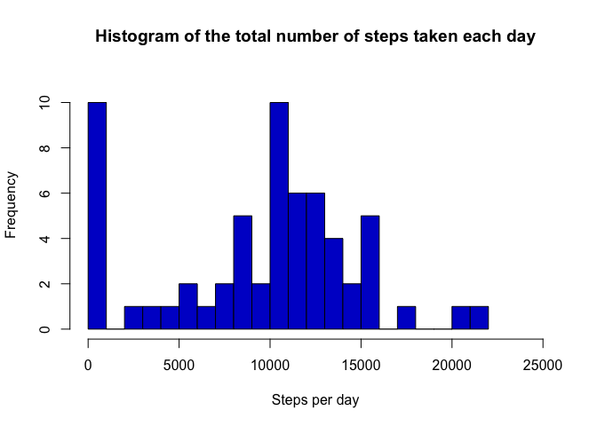
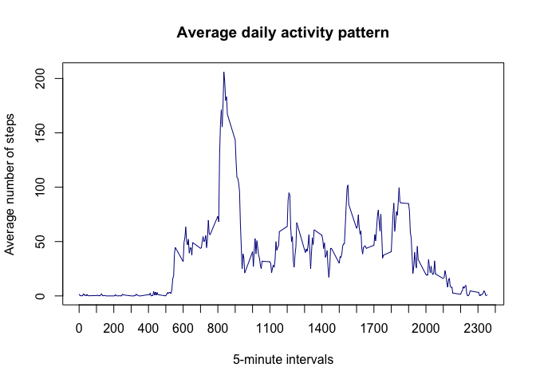
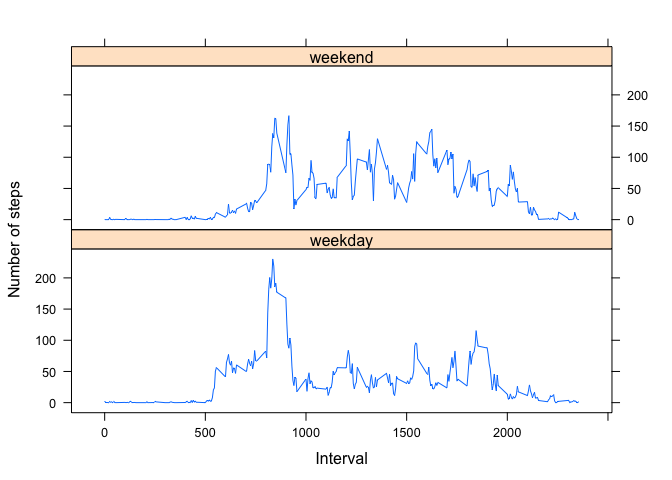

## Loading and preprocessing the data
  
     
Unzip the archive to the current working directory and load the data into "activity" variable

```r
setwd("../RepData_peerAssessment1/")
unzip("activity.zip",exdir="./")
activity<-read.csv("activity.csv", header=TRUE, stringsAsFactors = FALSE)
activity$steps<-as.numeric(activity$steps)
activity$date<-as.Date(activity$date)
activity$interval<-as.numeric(activity$interval)
```
   
The first few rows of the activity data set are

```r
head(activity)
```

```
##   steps       date interval
## 1    NA 2012-10-01        0
## 2    NA 2012-10-01        5
## 3    NA 2012-10-01       10
## 4    NA 2012-10-01       15
## 5    NA 2012-10-01       20
## 6    NA 2012-10-01       25
```
## What is mean total number of steps taken per day?


```r
s<-split(activity, activity$date)
activity_daily<-sapply(s, function(x) sum(x[,"steps"], na.rm=TRUE))
hist(activity_daily, breaks=20, main = "Histogram of the total number of steps taken each day", col="blue3", xlab = "Steps per day", xlim=c(0,25000), ylim=c(0,11))
```

<!-- -->

Average number of steps per day is

```r
mean(activity_daily)
```

```
## [1] 9354.23
```
and the median is

```r
median(activity_daily)
```

```
## [1] 10395
```
  
## What is the average daily activity pattern?


```r
s1<-split(activity,activity$interval)
activity_avg_int<-sapply(s1,function(x) mean(x[,"steps"], na.rm=TRUE))
intervals<-unique(activity$interval)
activity_ints<-data.frame("interval"=intervals, "avg_steps"=activity_avg_int, row.names = NULL)

with(activity_ints, plot(x=interval, y=avg_steps, type="l", main="Average daily activity pattern",xlab="5-minute intervals", ylab="Average number of steps", xaxp = c(0, 2400, 24), col="darkblue"))
```

<!-- -->

Looking for 5-minute interval that contains the maximum number of steps on average across all the days in the dataset:

```r
i<-activity_ints[activity_ints[,"avg_steps"]==max(activity_ints$avg_steps),]
i
```

```
##     interval avg_steps
## 104      835  206.1698
```
The interval is 835 with the average number of steps 206.2.
  
    
## Imputing missing values
1. The total number of missing values in the dataset (i.e. the total number of rows with NAs):

```r
bad<-!complete.cases(activity)
nrow(activity[bad,])
```

```
## [1] 2304
```
2. Strategy for filling in missing values: for every row where the number of steps is NA, the assigned value is the mean number of steps for that particular 5-minute interval rounded to the nearest integer.

```r
activity_complete<-activity
for (j in 1:nrow(activity)){
    if (is.na(activity[j,"steps"])){
        activity_complete[j,"steps"]<-round(activity_ints[activity_ints[,"interval"]==activity[j,"interval"], "avg_steps"],0)
    }
}
```

3. The new dataset that is equal to the original dataset but with the missing data filled in is stored as "activity_complete". First rows of the new data set are: 

```r
head(activity_complete)
```

```
##   steps       date interval
## 1     2 2012-10-01        0
## 2     0 2012-10-01        5
## 3     0 2012-10-01       10
## 4     0 2012-10-01       15
## 5     0 2012-10-01       20
## 6     2 2012-10-01       25
```
4. Histogram of the total number of steps taken each day

```r
s2<-split(activity_complete, activity_complete$date)
activity_daily2<-sapply(s2, function(x) sum(x[,"steps"], na.rm=TRUE))
hist(activity_daily2, breaks=20, main = "Histogram of the total number of steps taken each day", col="blue3", xlab = "Steps per day", xlim=c(0,25000), ylim=c(0,20))
```

<!-- -->

New mean and median of the total number of steps taken per day: 

```r
mean(activity_daily2)
```

```
## [1] 10765.64
```

```r
median(activity_daily2)
```

```
## [1] 10762
```

5. Questions. Do these values differ from the estimates from the first part of the assignment? What is the impact of imputing missing data on the estimates of the total daily number of steps?
  
The new values of mean and median are different from those calculated for the data set with the missing values. After the imputing missing data the estimates of the total daily number of steps (mean and median) become closer to each other and their values are bigger than before the modification.
  
  
## Are there differences in activity patterns between weekdays and weekends?
  
1. Create a new factor variable in the dataset with two levels – “weekday” and “weekend” indicating whether a given date is a weekday or weekend day.
    

```r
for (j in 1:nrow(activity)){
    if (weekdays(activity[j,"date"]) %in% c("Saturday","Sunday")){
        activity_complete[j,"weekday"]<-"weekend"
    } else {
        activity_complete[j,"weekday"]<-"weekday"
    }
}
```

This is how the data looks like now

```r
head(activity_complete)
```

```
##   steps       date interval weekday
## 1     2 2012-10-01        0 weekday
## 2     0 2012-10-01        5 weekday
## 3     0 2012-10-01       10 weekday
## 4     0 2012-10-01       15 weekday
## 5     0 2012-10-01       20 weekday
## 6     2 2012-10-01       25 weekday
```
2. Panel plot containing a time series plot of the 5-minute interval (x-axis) and the average number of steps taken, averaged across all weekday days or weekend days (y-axis).  


```r
s3<-split(activity_complete,activity_complete$interval)
avg_int_wd<-sapply(s3,function(x) mean(x[x[,"weekday"]=="weekday","steps"], na.rm=TRUE))
avg_int_we<-sapply(s3,function(x) mean(x[x[,"weekday"]=="weekend","steps"], na.rm=TRUE))
intervals<-unique(activity$interval)
activity_int_wd<-data.frame("interval"=intervals, "avg_steps"=avg_int_wd, "weekday"="weekday", row.names = NULL)
activity_int_we<-data.frame("interval"=intervals, "avg_steps"=avg_int_we, "weekday"="weekend", row.names = NULL)
activity_int<-rbind(activity_int_wd,activity_int_we)
activity_int<-transform(activity_int,weekday=factor(weekday))
```


```r
library(lattice)
xyplot(avg_steps~interval|weekday, data = activity_int, layout=c(1,2), type="l", xlab="Interval", ylab="Number of steps")
```

<!-- -->


